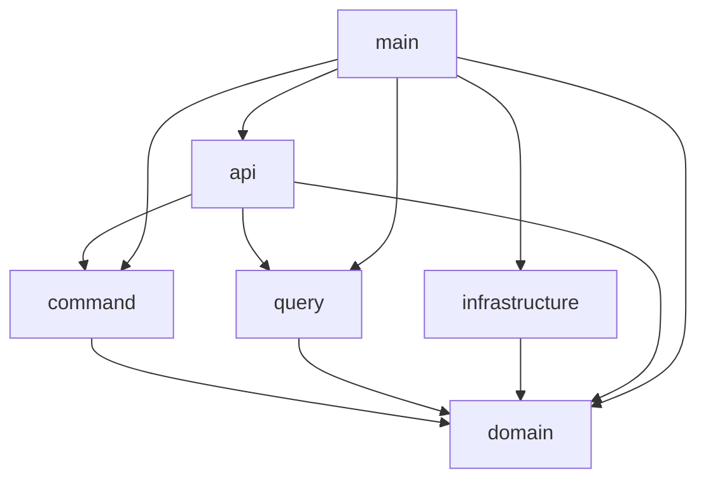

## はじめに

### 対象読者

- CQRS とは何かを知りたい人
- イベントソーシング とは何かを知りたい人
- Rust CQRS イベントソーシングで API を実装したい人

### 説明しないこと

- Rust の基本的な文法
- DDD の基本的な考え方
- CQRS の基本的な考え方
- イベントソーシングの基本的な考え方

以前、[Rust と DDD で API サーバーを構築する](https://zenn.dev/doctormate/articles/rust-ddd-7353b79179) 記事を書いたので、DDD を使った API サーバーの構築方法を知りたい方は、そちらを参考にしてください。今回はこのリポジトリをもとに、コードを書いています。

https://github.com/katayama8000/axum-ddd-rust

:::message
あくまでも _Rust_ で CQRS イベントソーシングを実装することが目的です。
基本的な考え方は公式ドキュメントや書籍を参考にすると良いでしょう。
:::

## CQRS とイベントソーシング

CQRS (Command Query Responsibility Segregation) は、コマンドとクエリの責任を分離するアーキテクチャスタイルです。


書き込み用の DB と読み取り用の DB を分け、何かしらの方法で同期します。
CQRS の利点は、書き込みと読み取りの責任を分離することで、システムのスケーラビリティを向上させることができる点などがあります。

また、今回は、イベントソーシングを併用します。
イベントソーシングは、状態の変更をイベントとして保存し、そのイベントを元に状態を再構築するアーキテクチャスタイルです。

## 作成するシステム

前回と同様、大学がサークルを管理するシステムを作成します。
簡単のため、今回のシステムは、サークル名とサークルの許容人数のみを管理するシステムとします。

## 依存関係



`domain` は どこにも依存していません。依存関係を逆転させて、`domain` はどこにも依存しないようにします。
`command` と `query` は `domain` のみに依存します。
`infrastructure` は `domain` に依存しますが、`command` と `query` には依存しません

各 crate をレイヤードアーキテクチャに当てはめると以下のようになります。

- domain: ドメイン層
- command: アプリケーション層
- query: アプリケーション層
- infrastructure: インフラ層
- api: プレゼンテーション層
- main: プレゼンテーション層

## DB のスキーマ

今回は、CQRS を用いて実装するため、コマンド用の DB とクエリ用の DB を分けます。

### コマンド用 DB (circle_events)

```sql
CREATE TABLE circle_events (
    id CHAR(36) PRIMARY KEY,                -- イベントID（UUID）
    circle_id CHAR(36) NOT NULL,            -- 集約ID（Circle ID）
    version INT NOT NULL,                   -- バージョン（楽観ロックに使用）
    event_type VARCHAR(100) NOT NULL,       -- イベント名（例: CircleCreated）
    payload JSON NOT NULL,                  -- イベント内容
    occurred_at DATETIME NOT NULL DEFAULT CURRENT_TIMESTAMP, -- イベント発生日時
);
```

### クエリ用 DB (circle_projections)

```sql
CREATE TABLE circle_projections (
    circle_id CHAR(36) PRIMARY KEY,         -- 集約ID（Circle ID）
    name VARCHAR(100) NOT NULL,             -- サークル名
    capacity SMALLINT NOT NULL,             -- 定員
    version INT NOT NULL,                   -- 最新バージョン
);
```

## コマンド側の実装

### domain crate

#### 集約

まずは、集約を作成します。

```rust
#[derive(Clone, Debug, Eq, PartialEq)]
pub struct Circle {
    pub id: CircleId,
    pub name: String,
    pub capacity: i16,
    pub version: Version,
}
```

version は、楽観的排他制御のために使用します。
ここまでは、DDD における集約となんら変わりませんね。

集約にメソッドを追加する前に、イベントを作成するための構造体を定義します。

```rust
#[derive(Clone, Debug)]
pub struct CircleEvent {
    pub circle_id: CircleId,
    pub data: EventData,
    pub id: EventId,
    pub occurred_at: NaiveDateTime,
    pub version: Version,
}

#[derive(Clone, Debug, Eq, PartialEq, Serialize, Deserialize)]
#[serde(rename_all = "snake_case", tag = "type")]
pub enum EventData {
    CircleCreated(CircleCreated),
    CircleUpdated(CircleUpdated),
}

#[derive(Clone, Debug, Eq, PartialEq, serde::Deserialize, serde::Serialize)]
pub struct CircleCreated {
    pub name: String,
    pub capacity: i16,
}

#[derive(Clone, Debug, Eq, PartialEq, serde::Deserialize, serde::Serialize)]
pub struct CircleUpdated {
    pub name: Option<String>,
    pub capacity: Option<i16>,
}
```

今回は、作成と更新用のイベントを作成します。他にも、削除イベントやもっと細かい単位のサークル名変更イベントなどを追加してもいいかもしれません。

この `CircleEvent` は、イベントを一意に識別するための ID と、具体的にどんなイベントが発生したのかを示す `EventData` などを持っています。
`EventData` は、イベントの種類を示すための enum です。イベントが追加されるたびに、この enum に新しいバリアントを追加することができます。

あとは、イベントを作成するメソッドを追加します。

```rust
impl CircleEvent {
    pub fn build(circle_id: CircleId, version: Version) -> CircleEventBuilder {
        CircleEventBuilder {
            circle_id,
            id: EventId::gen(),
            occurred_at: Utc::now().naive_utc(),
            version,
        }
    }
}

pub struct CircleEventBuilder {
    circle_id: CircleId,
    id: EventId,
    occurred_at: NaiveDateTime,
    version: Version,
}

impl CircleEventBuilder {
    pub fn circle_created(self, name: String, capacity: i16) -> CircleEvent {
        CircleEvent {
            circle_id: self.circle_id,
            data: CircleCreated { name, capacity }.into(),
            id: self.id,
            occurred_at: self.occurred_at,
            version: self.version,
        }
    }

    pub fn circle_updated(self, name: Option<String>, capacity: Option<i16>) -> CircleEvent {
        CircleEvent {
            circle_id: self.circle_id,
            data: CircleUpdated { name, capacity }.into(),
            id: self.id,
            occurred_at: self.occurred_at,
            version: self.version,
        }
    }
}
```

私は、専用のメソッドを追加しましたが、ここは好みの問題なので、違う方法でイベントを構築しても問題ありません。

次に、集約に `create` メソッドを追加します。

```rust
pub fn create(name: String, capacity: i16) -> Result<(Self, CircleEvent)> {
    Self::validate_capacity(capacity)?;
    let event = CircleEvent::build(CircleId::gen(), Version::new())
        .circle_created(name.clone(), capacity);
    let state = Self::from_created_event(event.clone());
    Ok((state, event))
}

fn from_created_event(event: CircleEvent) -> Self {
    match event.data {
        event::EventData::CircleCreated(event::CircleCreated { name, capacity }) => Self {
            id: event.circle_id,
            name,
            capacity,
            version: event.version,
        },
        _ => panic!("Invalid event for creation"),
    }
}
```

`create` メソッドは、では、イベントの発行とそのイベントを元に集約の状態を構築します。

同じ容量で、`update` メソッドを作成します。

```rust
pub fn update(
    self,
    name: Option<String>,
    capacity: Option<i16>,
) -> Result<(Self, CircleEvent)> {
    if let Some(new_capacity) = capacity {
        Self::validate_capacity(new_capacity)?;
    }
    let event = CircleEvent::build(self.id.clone(), self.version.clone())
        .circle_updated(name, capacity);
    let mut state = self.clone();
    state.apply_event(&event);
    Ok((state, event))
}

pub fn apply_event(&mut self, event: &CircleEvent) {
    match &event.data {
        event::EventData::CircleCreated(event::CircleCreated { name, capacity }) => {
            self.name = name.clone();
            self.capacity = *capacity;
            self.version = event.version.clone();
        }
        event::EventData::CircleUpdated(event::CircleUpdated { name, capacity }) => {
            if let Some(new_name) = name {
                self.name = new_name.clone();
            }
            if let Some(new_capacity) = capacity {
                self.capacity = *new_capacity;
            }
            self.version = event.version.clone();
        }
    }
}

```

`apply_event` メソッドは、イベントを適用して集約の状態を更新します。
あとは、イベントを再生するためのメソッドを追加します。

```rust
pub fn replay(events: Vec<CircleEvent>) -> Self {
    let mut state = match events.first() {
        Some(first_event) => Self::from_created_event(first_event.clone()),
        None => unreachable!("No events to initialize Circle"),
    };
    for event in events.iter().skip(1) {
        state.apply_event(event);
    }
    state
}
```

このメソッドは infrastructure crate で使用しますので、後述します。

#### インターフェース

command と query を分ける場合、インターフェースが複雑になることを防ぐことができます。
基本的にコマンド側のインターフェースは、単一の集約を取得するための取得メソッドと、更新メソッドを持ちます。

```rust
#[async_trait::async_trait]
pub trait CircleRepositoryInterface: Send + Sync {
    async fn find_by_id(&self, circle_id: &CircleId) -> Result<Circle, Error>;
    async fn store(
        &self,
        events: Vec<crate::aggregate::circle::event::CircleEvent>,
    ) -> Result<(), Error>;
}
```

もし、command と query を分けない場合、`find_all` や `find_by_name` などのメソッドが追加される可能性があり、複雑なインターフェースになっていきます。

### infrastructure crate

ここでは、先ほど、定義した `CircleRepositoryInterface` を実装します。

まずは、`store` メソッドを実装します。

```rust
async fn store(
    &self,
    events: Vec<event::CircleEvent>,
) -> Result<(), anyhow::Error> {
    if events.is_empty() {
        tracing::info!("No events to store");
        return Ok(());
    }

    let events_for_logging = events.clone();

    {
        let mut transaction = self.db.begin().await?;

        for event in events {
            let event_data = CircleEventData::try_from(event.clone())?;

            sqlx::query("INSERT INTO circle_events (circle_id, id, occurred_at, event_type, version, payload) VALUES (?, ?, ?, ?, ?, ?)")
            .bind(event_data.circle_id.clone())
            .bind(event_data.id)
            .bind(event_data.occurred_at)
            .bind(event_data.event_type.clone())
            .bind(event_data.version)
            .bind(event_data.payload.clone())
            .execute(&mut *transaction)
            .await.map_err(|e| {
                anyhow::Error::msg("Failed to insert circle event")
            })?;
        }

        transaction.commit().await?;
    }
    Ok(())
}
```

イベントをコマンド用の DB に保存します。
ここで今までのステートソーシングとの大きな違いを感じるかもしれません。

ステートソーシングでは、集約の状態を DB に保存しますが、イベントソーシングでは、イベントを DB に保存します。

例えば、ユーザーが、作成 -> 更新 -> 更新 操作を行った場合、ステートソーシングでは、DB に保存されるのは、最新の状態のみです。対して、イベントソーシングでは、ユーザーが行った操作の履歴が DB に保存されます。

- ステートソーシングの場合

1. 作成
   | name | capacity |
   | -------- | -------- |
   | football | 20 |

2. 更新
   | name | capacity |
   | -------- | -------- |
   | football | 30 |

3. 更新
   | name | capacity |
   | -------- | -------- |
   | baseball | 40 |

- イベントソーシング

1. 作成
   | name | capacity | event_type | version |
   |------|----------|----------|------|
   |football|20|CircleCreated|1|
2. 更新
   | name | capacity | event_type | version |
   |------|----------|----------|------|
   |football|20|CircleCreated|1|
   |football|30|CircleUpdated|2|
3. 更新
   | name | capacity | event_type | version |
   | -------- | -------- | ------------- | ------- |
   | football | 20 | CircleCreated | 1 |
   | football | 30 | CircleUpdated | 2 |
   | baseball | 40 | CircleUpdated | 3 |

上の図を見てわかるように、ステートソーシングでは、ユーザーが行った操作の履歴が残りませんが、イベントソーシングでは、ユーザーが行った操作の履歴が残ります。このサークルはもともと football サークル だったのに、途中で baseball サークル に変わった、奇妙なサークルがということがバレてしまいますね！

次に、`find_by_id` メソッドを実装します。

```rust
async fn find_by_id(&self, circle_id: &CircleId) -> Result<Circle, anyhow::Error> {
    let event_query = sqlx::query("SELECT * FROM circle_events WHERE circle_id = ?")
        .bind(circle_id.to_string());
    let event_rows = event_query.fetch_all(&self.db).await.map_err(|e| {
        anyhow::Error::msg("Failed to fetch circle events by circle_id")
    })?;

    let event_data = event_rows
        .iter()
        .map(|row| CircleEvent::from_circle_event_data(CircleEventData::from_row(row)))
        .collect::<Result<Vec<CircleEvent>, _>>()?;

    // Sort events by version
    let mut event_data = event_data;
    event_data.sort_by(|a, b| a.version.cmp(&b.version));
    Ok(Circle::replay(event_data.clone()))
}
```

ステートソーシングでは、id に紐づくレコードを取得すれば良いですが、イベントソーシングでは、イベントが全て保存されているので、そう簡単にはいきません。

まずは、circle id に紐づくイベントを全て取得します。
次に、取得したイベントをバージョン順にソートします。

そして、先ほど定義した `Circle::replay` メソッドを使用して、イベントを元に集約の状態を構築します。

```rust
pub fn replay(events: Vec<CircleEvent>) -> Self {
    let mut state = match events.first() {
        Some(first_event) => Self::from_created_event(first_event.clone()),
        None => unreachable!("No events to initialize Circle"),
    };
    for event in events.iter().skip(1) {
        state.apply_event(event);
    }
    state
}
```

一番目のイベントは作成イベントのはずなので、そうではない場合、パニックします。
その後、イベントを順番に適用していきます。

これで、集約の状態をイベントから再構築することに成功しました。

### command crate

コマンドでは、集約を操作するためのコマンドを定義します。
サークルを更新するためのコマンドを定義します。

```rust
#[derive(Debug, Deserialize)]
pub struct Input {
    pub circle_id: String,
    pub circle_name: Option<String>,
    pub capacity: Option<i16>,
    pub version: u32,
}

#[derive(Debug)]
pub struct Output {
    pub circle_id: String,
}

pub async fn handle(
    circle_repository: Arc<dyn CircleRepositoryInterface + Send + Sync>,
    Input {
        circle_id,
        circle_name,
        capacity,
        version,
    }: Input,
) -> Result<Output, Error> {
    let circle_id = CircleId::from_str(circle_id.as_str()).map_err(|_| Error::InvalidInput)?;
    let version = Version::from(version);

    let circle = circle_repository
        .find_by_id(&circle_id)
        .await
        .map_err(|_| Error::Circle)?;

    let (circle, event) = circle
        .update(circle_name, capacity)
        .map_err(|_| Error::InvalidInput)?;

    if circle.version != version {
        return Err(Error::VersionMismatch);
    }

    circle_repository
        .store(vec![event])
        .await
        .map_err(|_| Error::Circle)?;

    Ok(Output {
        circle_id: circle.id.to_string(),
    })
}
```

先ほど実装した、`find_by_id` メソッドを使って、イベントを再生して、集約を構築します。
その後、`update` メソッドを使用して、集約を更新とイベントを発行します。
最後に、発行したイベントを コマンド用の DB に保存します。
簡単ですね。

### main crate & api crate

CQRS や イベントソーシング特有のものではないので、簡単な説明に留めます。

#### main crate

アプリケーションのエントリーポイントであり、依存関係の解決を行います。
また、ログの設定や、環境変数の読み込み等も行います。

### api crate

ルーティングの設定や、リクエストの処理を行います。
また、リクエストのバリデーションや、レスポンスの整形等も行います。

Rust で DI するには一手間必要ですが、興味のある方は、私のリポジトリをのぞいてみてください。

ここまでで、コマンド側の実装は完了です。
ユーザーが操作するたびに、イベントが発行され、コマンド用の DB に保存されるようになりました。

## クエリ側の実装

CQRS では文字通り、コマンドとクエリを分けます。このリポジトリでは、アプリケーションレイヤーに相当する部分では、crate を command と query に分けていますが、domain や　 infrastructure は分けていません。

読み取り専用の model を作成したり、読み取り専用の interface を作成したりすると、アーキテクチャ的に綺麗になるかもしれません。必ずしも今回私が、実装したものが正というわけではありませんので、参考程度にしてください。

クエリ側では、何らかしらの方法で、コマンド用の DB に保存されたイベントをクエリ用の DB に保存する必要があります。
例えば、Pub/Sub などのメッセージングシステムを使用して、コマンド用の DB に保存されたイベントをクエリ用の DB に保存することができます。
DB のトリガーを使用して、コマンド用の DB に保存されたイベントが永続化されたら、API にリクエストを送信して、クエリ用の DB に保存することもできます。

私は今回、最もフィジカルで最もプリミティブで最もフェティッシュな方法で、コマンド用の DB に保存されたイベントをクエリ用の DB に保存することにしました。

```rust
async fn store(
    &self,
    events: Vec<event::CircleEvent>,
) -> Result<(), anyhow::Error> {
    if events.is_empty() {
        tracing::info!("No events to store");
        return Ok(());
    }

    let events_for_logging = events.clone();

    {
        let mut transaction = self.db.begin().await?;

        for event in events {
            let event_data = CircleEventData::try_from(event.clone())?;

            sqlx::query("INSERT INTO circle_events (circle_id, id, occurred_at, event_type, version, payload) VALUES (?, ?, ?, ?, ?, ?)")
            .bind(event_data.circle_id.clone())
            .bind(event_data.id)
            .bind(event_data.occurred_at)
            .bind(event_data.event_type.clone())
            .bind(event_data.version)
            .bind(event_data.payload.clone())
            .execute(&mut *transaction)
            .await.map_err(|e| {
                anyhow::Error::msg("Failed to insert circle event")
            })?;
        }

        transaction.commit().await?;
    }

    {
        let mut transaction = self.db.begin().await?;

        let first_event = events_for_logging
            .first()
            .ok_or_else(|| anyhow::Error::msg("No events found"))?;
        let mut current_circle = self.find_by_id(&first_event.circle_id).await?;
        for event in &events_for_logging {
            current_circle.apply_event(event);
        }
        let data = CircleProtectionData::try_from(current_circle.clone())?;

        sqlx::query("REPLACE INTO circle_projections (circle_id, name, capacity, version) VALUES (?, ?, ?, ?)",)
            .bind(data.circle_id.to_string())
            .bind(data.name.to_string())
            .bind(data.capacity)
            .bind(data.version)
            .execute(&mut *transaction)
            .await.map_err(|e| {
                anyhow::Error::msg("Failed to update circle projection")
            })?;

        transaction.commit().await?;
    }
    Ok(())
}
```

イベントをコマンド用の DB に保存した後、クエリ用の DB に保存します。...あんまりいい方法ではないですね。サンプルコードなので、容赦してください。筆者の気力が尽きてしまいました。PR を送っていただければ、レビューをする気力は残っているので、お時間ある方はぜひ。

残りのレイヤーのコードは、コマンド側とさほど変わりませんので、リポジトリを見ていただければと思います。

## まとめ

CQRS とイベントソーシングを用いて、API サーバーを構築する方法を紹介しました。イベントソーシングを導入したら、必ずしも全てイベントソーシングで実装する必要はなく、イベントの履歴が必要な部分だけイベントソーシングを導入し、他の部分はステートソーシングで実装することもできます。アーキテクチャのパターンの一つとして、CQRS とイベントソーシングを用いることができるということを知っていただければエンジニアとして少し強くなれるのではなかろうかと思います。下にあるリポジトリは Docker コンテナ上で動作するようにしているので、実際に動かして、感覚を掴む等、皆さんの理解のお役に立てれば幸いです。(PR 大歓迎)

https://github.com/katayama8000/axum-cqrs-rust
