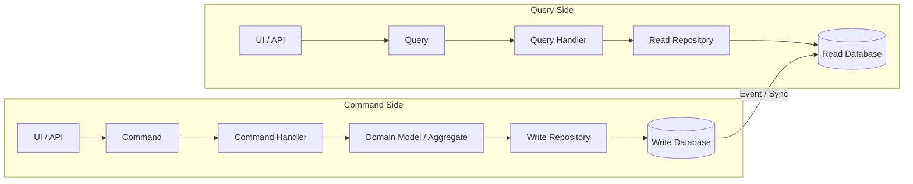
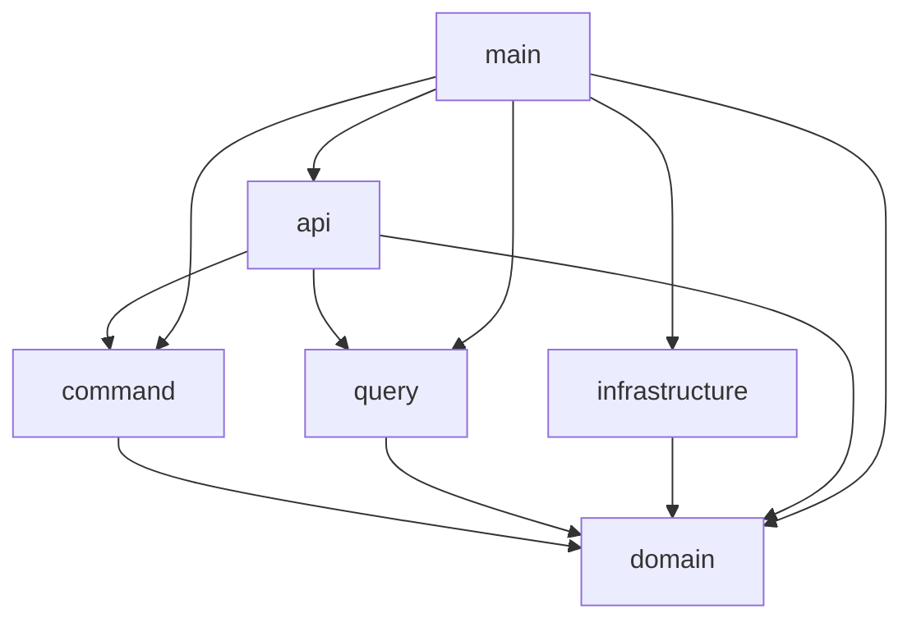
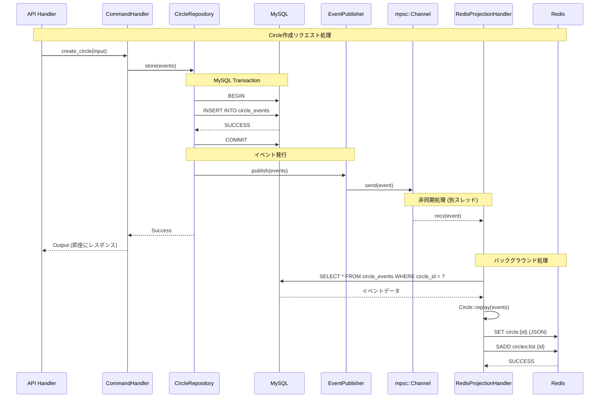
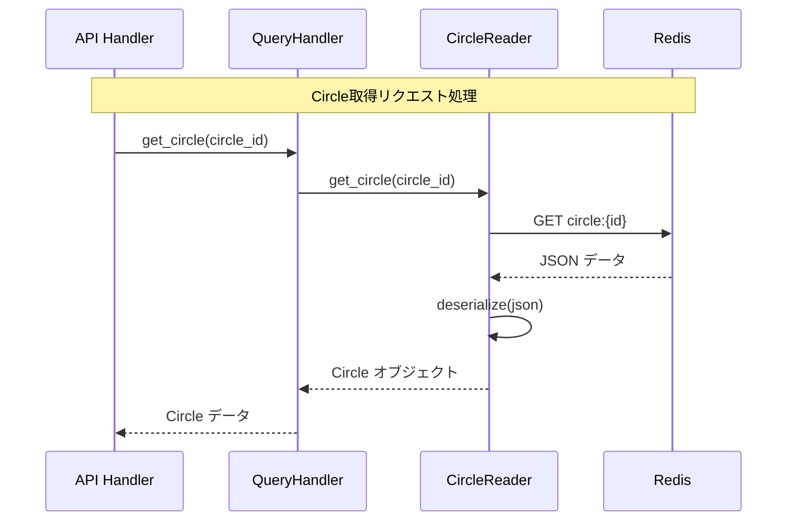

この記事はヌーラボブログリレー2025 冬の1日目として投稿しています

始まりました、ヌーラボブログリレー2025 冬。この後も様々な記事が投稿される予定ですので、ぜひご覧ください！

https://adventar.org/calendars/11965

## はじめに

### 対象読者

- CQRS とは何かを知りたい人
- イベントソーシング とは何かを知りたい人
- Rust CQRS イベントソーシングで API を実装したい人

### 説明しないこと

- Rustの基本的な文法
- DDDの基本的な考え方

以前、[Rust と DDD で API サーバーを構築する](https://zenn.dev/doctormate/articles/rust-ddd-7353b79179) 記事を書いたので、DDD を使った APIサーバーの構築方法を知りたい方は、そちらを参考にしてください。今回はそのリポジトリをもとに、コードを書いています。

https://github.com/katayama8000/axum-ddd-rust

:::message
あくまでも _Rust_ で CQRS イベントソーシングを実装することが目的です。
基本的な考え方は公式ドキュメントや書籍を参考にすると良いでしょう。
:::

### CQRSとイベントソーシングによるアーキテクチャ

#### CQRS（コマンド・クエリ責任分離）とは

CQRS（Command and Query Responsibility Segregation）は、システムの操作を「コマンド（状態を変更する操作）」と「クエリ（状態を読み取る操作）」の2つに分離する設計パターンです。

多くの場合、書き込み処理に最適化されたコマンドモデルと、読み取り処理に最適化されたクエリモデル（リードモデル）をそれぞれ用意します。これにより、書き込み用のデータベースと読み取り用のデータベースを物理的に分離し、それぞれの要件に合わせて最適化することが可能になります。



**主な利点:**

*   **スケーラビリティの向上**: 読み取りと書き込みの負荷に応じて、それぞれを独立してスケールさせることができます。
*   **パフォーマンスの最適化**: リードモデルでは、クエリに最適化されたデータ構造を予め構築しておくことができます。これにより、N+1問題のような典型的なパフォーマンス上の課題を根本的に解決しやすくなります。
*   **関心の分離**: 複雑なビジネスロジックを持つ書き込み側と、多様なデータ取得要件に応える読み取り側を分離でき、コードの保守性が向上します。

#### イベントソーシングとは

イベントソーシングは、アプリケーションの現在の状態を直接保存するのではなく、状態を変更した 「イベント」のシーケンス（履歴）としてすべてを保存するアーキテクチャスタイルです。現在の状態が必要な場合は、これらのイベントを最初から再生することでいつでも再構築できます。

#### CQRSとイベントソーシングの組み合わせ

この2つのパターンは非常に相性が良く、組み合わせて利用されることがよくあります。その場合のデータの流れは以下のようになります。

1.  **コマンドサイド**: コマンドを受け取ると、ビジネスロジックを実行し、結果としてイベントを生成し、イベントストアに永続化します。これがシステムにおける唯一の信頼できる情報源（Source of Truth）となります。
2.  **同期**: 生成されたイベントを非同期で購読するプロセス（プロジェクター）が、それを元に**クエリサイド**のリードモデル（読み取り用DB）を構築・更新します。
3.  **クエリサイド**: ユーザーは、特定の表示要件に合わせて最適化されたリードモデルから高速にデータを取得します。

この構成により、書き込み処理の堅牢性と、読み取り処理のパフォーマンスおよび柔軟性を両立した、スケーラブルなシステムを構築することが可能になります。

## 作成するシステム

大学がサークルを管理するシステムを作成します。
簡単のため、今回のシステムは、サークル名とサークルの許容人数のみを管理するシステムとします。

## 各レイヤーの依存関係



`domain` はどこにも依存していません。依存関係を逆転させて、`domain` はどこにも依存しないようにします。
`command` と `query` は `domain` のみに依存します。
`infrastructure` は `domain` に依存しますが、`command` と `query` には依存しません。

各 crate をレイヤーに当てはめると以下のようになります。

- domain: ドメイン層
- command: アプリケーション層
- query: アプリケーション層
- infrastructure: インフラ層
- api: プレゼンテーション層
- main: プレゼンテーション層

## DB のスキーマ

今回は、CQRS を用いて実装するため、コマンド用の DB とクエリ用の DB を分けます。
コマンド用の DB には、MySQL を使用し、クエリ用の DB には、Redis を使用します。
私は今回、MySQL と Redis を使用しましたが、MySQL のみで CQRS を実装することも可能です。

### コマンド用 DB (MySQL)
#### circle_events

```sql
CREATE TABLE circle_events (
    id CHAR(36) PRIMARY KEY,                -- イベントID（UUID）
    circle_id CHAR(36) NOT NULL,            -- 集約ID（Circle ID）
    version INT NOT NULL,                   -- バージョン（楽観ロックに使用）
    event_type VARCHAR(100) NOT NULL,       -- イベント名（例: CircleCreated）
    payload JSON NOT NULL,                  -- イベント内容
    occurred_at DATETIME NOT NULL DEFAULT CURRENT_TIMESTAMP, -- イベント発生日時
);
```

#### circle_snapshots
```sql
CREATE TABLE IF NOT EXISTS circle_snapshots (
    id BIGINT AUTO_INCREMENT PRIMARY KEY,
    circle_id CHAR(36) NOT NULL,
    version INT NOT NULL,
    state JSON NOT NULL,
    created_at DATETIME NOT NULL DEFAULT CURRENT_TIMESTAMP,
    INDEX idx_circle_version (circle_id, version DESC)
);
```

### クエリ用 DB (Redis)
```bash
Key: circle:{circle_id}
Type: String (JSON)

GET circle:UxrE3ub9wrJIuEAP6TqnH2S62YpTPUj9GCZe
-> {
     "id": "UxrE3ub9wrJIuEAP6TqnH2S62YpTPUj9GCZe",
     "name": "test sync club",
     "capacity": 8,
     "version": 1
   }
```

## コマンド側の実装

### domain crate

#### 集約

まずは、集約を作成します。

```rust
#[derive(Clone, Debug, Eq, PartialEq)]
pub struct Circle {
    pub id: CircleId,
    pub name: String,
    pub capacity: i16,
    pub version: Version,
}
```

version は、楽観的排他制御のために使用します。
ここまでは、DDD における集約となんら変わりませんね。

集約にメソッドを追加する前に、イベントを作成するための構造体を定義します。

```rust
#[derive(Clone, Debug)]
pub struct CircleEvent {
    pub circle_id: CircleId,
    pub data: EventData,
    pub id: EventId,
    pub occurred_at: NaiveDateTime,
    pub version: Version,
}

#[derive(Clone, Debug, Eq, PartialEq, Serialize, Deserialize)]
#[serde(rename_all = "snake_case", tag = "type")]
pub enum EventData {
    CircleCreated(CircleCreated),
    CircleUpdated(CircleUpdated),
}

#[derive(Clone, Debug, Eq, PartialEq, serde::Deserialize, serde::Serialize)]
pub struct CircleCreated {
    pub name: String,
    pub capacity: i16,
}

#[derive(Clone, Debug, Eq, PartialEq, serde::Deserialize, serde::Serialize)]
pub struct CircleUpdated {
    pub name: Option<String>,
    pub capacity: Option<i16>,
}
```

今回は、作成と更新用のイベントを作成します。他にも、削除イベントやもっと細かい単位のサークル名変更イベントなどを追加してもいいかもしれません。ビジネス要件に応じて、イベントを追加すると良いです。

この `CircleEvent` は、イベントを一意に識別するための ID と、具体的にどんなイベントが発生したのかを示す `EventData` などを持っています。
`EventData` は、イベントの種類を示すための enum です。イベントが追加されるたびに、この enum に新しいバリアントを追加することができます。

あとは、イベントを作成するメソッドを追加します。

```rust
impl CircleEvent {
    pub fn build(circle_id: CircleId, version: Version) -> CircleEventBuilder {
        CircleEventBuilder {
            circle_id,
            id: EventId::gen(),
            occurred_at: Utc::now().naive_utc(),
            version,
        }
    }
}

pub struct CircleEventBuilder {
    circle_id: CircleId,
    id: EventId,
    occurred_at: NaiveDateTime,
    version: Version,
}

impl CircleEventBuilder {
    pub fn circle_created(self, name: String, capacity: i16) -> CircleEvent {
        CircleEvent {
            circle_id: self.circle_id,
            data: CircleCreated { name, capacity }.into(),
            id: self.id,
            occurred_at: self.occurred_at,
            version: self.version,
        }
    }

    pub fn circle_updated(self, name: Option<String>, capacity: Option<i16>) -> CircleEvent {
        CircleEvent {
            circle_id: self.circle_id,
            data: CircleUpdated { name, capacity }.into(),
            id: self.id,
            occurred_at: self.occurred_at,
            version: self.version,
        }
    }
}
```

次に、集約に `create` メソッドを追加します。

```rust
pub fn create(name: String, capacity: i16) -> Result<(Self, CircleEvent)> {
    Self::validate_capacity(capacity)?;
    let event = CircleEvent::build(CircleId::gen(), Version::new())
        .circle_created(name.clone(), capacity);
    let state = Self::from_created_event(event.clone());
    Ok((state, event))
}

fn from_created_event(event: CircleEvent) -> Self {
    match event.data {
        event::EventData::CircleCreated(event::CircleCreated { name, capacity }) => Self {
            id: event.circle_id,
            name,
            capacity,
            version: event.version,
        },
        _ => panic!("Invalid event for creation"),
    }
}
```

`create` メソッドでは、イベントの発行とそのイベントを元に集約の状態を構築します。

同じ要領で、`update` メソッドを作成します。

```rust
pub fn update(
    self,
    name: Option<String>,
    capacity: Option<i16>,
) -> Result<(Self, CircleEvent)> {
    if let Some(new_capacity) = capacity {
        Self::validate_capacity(new_capacity)?;
    }
    let event = CircleEvent::build(self.id.clone(), self.version.clone())
        .circle_updated(name, capacity);
    let mut state = self.clone();
    state.apply_event(&event);
    Ok((state, event))
}

pub fn apply_event(&mut self, event: &CircleEvent) {
    match &event.data {
        event::EventData::CircleCreated(event::CircleCreated { name, capacity }) => {
            self.name = name.clone();
            self.capacity = *capacity;
            self.version = event.version.clone();
        }
        event::EventData::CircleUpdated(event::CircleUpdated { name, capacity }) => {
            if let Some(new_name) = name {
                self.name = new_name.clone();
            }
            if let Some(new_capacity) = capacity {
                self.capacity = *new_capacity;
            }
            self.version = event.version.clone();
        }
    }
}

```

`apply_event` メソッドは、イベントを適用して集約の状態を更新します。
あとは、イベントを再生するためのメソッドを追加します。

```rust
pub fn replay(events: Vec<CircleEvent>) -> Self {
    let mut state = match events.first() {
        Some(first_event) => Self::from_created_event(first_event.clone()),
        None => unreachable!("No events to initialize Circle"),
    };
    for event in events.iter().skip(1) {
        state.apply_event(event);
    }
    state
}
```

このメソッドは infrastructure crate 等で使用しますので、後述します。

#### インターフェース

command と query を分ける場合、インターフェースが複雑になることを防ぐことができます。
基本的にコマンド側のインターフェースは、単一の集約を取得するための取得メソッドと、更新メソッドを持ちます。

```rust
#[async_trait::async_trait]
pub trait CircleRepositoryInterface: Send + Sync {
    async fn find_by_id(&self, circle_id: &CircleId) -> Result<Circle, Error>;
    async fn store(
        &self,
        events: Vec<crate::aggregate::circle::event::CircleEvent>,
    ) -> Result<(), Error>;
}
```

クエリ側のインターフェースは、様々な条件で集約を取得するためのメソッドを持ちます。とはいえ、今回は非常にシンプルなシステムなので、単一の集約を取得するためのメソッドと、全ての集約を取得するためのメソッドのみを持ちます。

```rust
#[async_trait::async_trait]
pub trait CircleReaderInterface: Send + Sync {
    async fn get_circle(&self, circle_id: CircleId) -> Result<Option<Circle>, anyhow::Error>;
    async fn list_circles(&self) -> Result<Vec<Circle>, anyhow::Error>;
}
```

### infrastructure crate

ここでは、先ほど、定義した `CircleRepositoryInterface` を実装します。

まずは、`store` メソッドを実装します。

```rust
async fn store(
    &self,
    events: Vec<event::CircleEvent>,
) -> Result<(), anyhow::Error> {
    if events.is_empty() {
        tracing::info!("No events to store");
        return Ok(());
    }

    {
        let mut transaction = self.db.begin().await?;

        for event in &events {
            let event_data = CircleEventData::try_from(event.clone())?;

            sqlx::query("INSERT INTO circle_events (circle_id, id, occurred_at, event_type, version, payload) VALUES (?, ?, ?, ?, ?, ?)")
            .bind(event_data.circle_id.clone())
            .bind(event_data.id)
            .bind(event_data.occurred_at)
            .bind(event_data.event_type.clone())
            .bind(event_data.version)
            .bind(event_data.payload.clone())
            .execute(&mut *transaction)
            .await.map_err(|e| {
                anyhow::Error::msg("Failed to insert circle event")
            })?;
        }

        transaction.commit().await?;
    }
    Ok(())
}
```

イベントをコマンド用の DB に保存します。
ここでステートソーシングとの大きな違いを感じるかもしれません。

ステートソーシングでは、集約の状態を DB に保存しますが、イベントソーシングでは、イベントを DB に保存します。

例えば、ユーザーが、作成 -> 更新 -> 更新 操作を行った場合、ステートソーシングでは、DB に保存されるのは、最新の状態のみです。対して、イベントソーシングでは、ユーザーが行った操作の履歴が DB に保存されます。

- ステートソーシングの場合

1. 作成
   | name | capacity |
   | -------- | -------- |
   | football | 20 |

2. 更新
   | name | capacity |
   | -------- | -------- |
   | football | 30 |

3. 更新
   | name | capacity |
   | -------- | -------- |
   | baseball | 40 |

- イベントソーシング

1. 作成
   | name | capacity | event_type | version |
   |------|----------|----------|------|
   |football|20|CircleCreated|1|
2. 更新
   | name | capacity | event_type | version |
   |------|----------|----------|------|
   |football|20|CircleCreated|1|
   |football|30|CircleUpdated|2|
3. 更新
   | name | capacity | event_type | version |
   | -------- | -------- | ------------- | ------- |
   | football | 20 | CircleCreated | 1 |
   | football | 30 | CircleUpdated | 2 |
   | baseball | 40 | CircleUpdated | 3 |

上の図を見てわかるように、ステートソーシングでは、ユーザーが行った操作の履歴が残りませんが、イベントソーシングでは、ユーザーが行った操作の履歴が残ります。このサークルはもともと football サークル だったのに、baseball サークル に変わった、奇妙なサークルということがバレてしまいますね！

次に、`find_by_id` メソッドを実装します。

```rust
async fn find_by_id(&self, circle_id: &CircleId) -> Result<Circle, anyhow::Error> {
    let event_query = sqlx::query("SELECT * FROM circle_events WHERE circle_id = ?")
        .bind(circle_id.to_string());
    let event_rows = event_query.fetch_all(&self.db).await.map_err(|e| {
        anyhow::Error::msg("Failed to fetch circle events by circle_id")
    })?;

    let event_data = event_rows
        .iter()
        .map(|row| CircleEvent::from_circle_event_data(CircleEventData::from_row(row)))
        .collect::<Result<Vec<CircleEvent>, _>>()?;

    // Sort events by version
    let mut event_data = event_data;
    event_data.sort_by(|a, b| a.version.cmp(&b.version));
    Ok(Circle::replay(event_data.clone()))
}
```

ステートソーシングでは、id に紐づくレコードを取得すれば良いですが、イベントソーシングでは、イベントが全て永続化されているので、そう簡単にはいきません。

まずは、circle id に紐づくイベントを全て取得します。
次に、取得したイベントをバージョン順にソートします。

そして、先ほど定義した `Circle::replay` メソッドを使用して、イベントを元に集約の状態を構築します。

```rust
pub fn replay(events: Vec<CircleEvent>) -> Self {
    let mut state = match events.first() {
        Some(first_event) => Self::from_created_event(first_event.clone()),
        None => unreachable!("No events to initialize Circle"),
    };
    for event in events.iter().skip(1) {
        state.apply_event(event);
    }
    state
}
```

一番目のイベントは作成イベントのはずなので、そうではない場合、パニックします。
その後、イベントを順番に適用していきます。

例えば、以下のようなイベントがあった場合、
1. CircleCreated { name: "football", capacity: 20 } (version: 1)
2. CircleUpdated { name: None, capacity: 30 } (version: 2)
3. CircleUpdated { name: "baseball", capacity: 40 } (version: 3)
`replay` メソッドは、以下のように動作します。

- 1 番目のイベントを適用
  - 集約の状態: { id: ..., name: "football", capacity: 20, version: 1 }
- 2 番目のイベントを適用
  - 集約の状態: { id: ..., name: "football", capacity: 30, version: 2 }
- 3 番目のイベントを適用
  - 集約の状態: { id: ..., name: "baseball", capacity: 40, version: 3 }

これで、`find_by_id` メソッドの実装は完了です。


### command crate

コマンドでは、集約を操作するためのコマンドを定義します。
サークルを更新するためのコマンドを定義します。

```rust
#[derive(Debug, Deserialize)]
pub struct Input {
    pub circle_id: String,
    pub circle_name: Option<String>,
    pub capacity: Option<i16>,
    pub version: u32,
}

#[derive(Debug)]
pub struct Output {
    pub circle_id: String,
}

pub async fn handle(
    circle_repository: Arc<dyn CircleRepositoryInterface + Send + Sync>,
    Input {
        circle_id,
        circle_name,
        capacity,
        version,
    }: Input,
) -> Result<Output, Error> {
    let circle_id = CircleId::from_str(circle_id.as_str()).map_err(|_| Error::InvalidInput)?;
    let version = Version::from(version);

    let circle = circle_repository
        .find_by_id(&circle_id)
        .await
        .map_err(|_| Error::Circle)?;

    let (circle, event) = circle
        .update(circle_name, capacity)
        .map_err(|_| Error::InvalidInput)?;

    if circle.version != version {
        return Err(Error::VersionMismatch);
    }

    circle_repository
        .store(vec![event])
        .await
        .map_err(|_| Error::Circle)?;

    Ok(Output {
        circle_id: circle.id.to_string(),
    })
}
```

先ほど実装した、`find_by_id` メソッドを使って、イベントを再生して、集約を構築します。
その後、`update` メソッドを使用して、集約を更新とイベントを発行します。
最後に、発行したイベントを コマンド用の DB に保存します。
簡単ですね。

### main crate & api crate

CQRS や イベントソーシング特有のものではないので、簡単な説明に留めます。

#### main crate

アプリケーションのエントリーポイントであり、依存関係の解決を行います。
また、ログの設定や、環境変数の読み込み等も行います。

### api crate

ルーティングの設定や、リクエストの処理を行います。
また、リクエストのバリデーションや、レスポンスの整形等も行います。

Rust で DI するには一手間必要ですが、興味のある方は、私のリポジトリをのぞいてみてください。

ここまでで、コマンド側の実装は完了です。
ユーザーが操作するたびに、イベントが発行され、コマンド用の DB に保存されるようになりました。

## コマンドとクエリの同期
CQRS では、コマンド用の DB とクエリ用の DB を同期する必要があります。

様々な方法がありますが、今回は `EventPublisher` を実装してイベントを非同期で処理するための仕組みを作ります。

`EventPublisher` は、MySQL（コマンド側）で発生したイベントを Redis（クエリ側）に非同期で伝播させる責務を持ちます。以下のような trait として定義します：

この trait を実装する ChannelEventPublisher は、Tokio の mpsc::unbounded_channel を使用してイベントを送信します。非同期チャンネルを使うことで、コマンド処理をブロックせずにイベントを publish できます。

https://github.com/katayama8000/axum-cqrs-rust/blob/main/src/crates/infrastructure/src/event_publisher.rs

### イベント処理の流れ

1. アプリケーション起動時に、イベントシステムをセットアップします

```rust
async fn setup_event_system(
    redis_client: redis::Client,
    db: sqlx::MySqlPool,
) -> Arc<dyn EventPublisher> {
    // Publisher と Receiver を作成
    let (event_publisher, event_receiver) = ChannelEventPublisher::new();
    let redis_handler = RedisProjectionHandler::new(redis_client, db);
    
    // 別スレッドでイベント処理を開始
    tokio::spawn(async move {
        redis_handler.start_processing(event_receiver).await;
    });
    
    Arc::new(event_publisher)
}
```

ここでは以下の処理を行っています。
- ChannelEventPublisher を作成し、sender と receiver を取得
- RedisProjectionHandler を作成（イベントを受け取り Redis に投影する責務）
- バックグラウンドタスクとして start_processing を起動
- EventPublisher を返却して、サーバー起動時に Repository に注入

2. コマンド実行時のイベント発行

CircleRepository でイベントを MySQL に保存した後、EventPublisher を使ってイベントを発行します。

```rust
async fn store(
    &self,
    _version: Option<version::Version>,
    events: Vec<event::CircleEvent>,
) -> Result<(), anyhow::Error> {
    // Step 1: Store events in MySQL (source of truth)
    {
        let mut transaction = self.db.begin().await?;
        for event in events {
            // MySQL へイベントを保存
            // ...
        }
        transaction.commit().await?;
    }

    // Step 2: Publish events for Redis update
    if let Err(e) = self.event_publisher.publish(events_for_logging.clone()).await {
        tracing::error!("Failed to publish events: {:?}", e);
    }

    Ok(())
}
```

3. バックグラウンドでの投影処理

RedisProjectionHandler は、チャンネルからイベントを受け取り、Redis に投影します。

```rust
pub async fn handle_event(&self, event: CircleEvent) -> Result<()> {
    // 1. MySQL から最新のイベントを取得して Circle を再構築
    let circle = self.rebuild_circle_from_events(&event.circle_id).await?;
    
    // 2. Redis に保存
    self.save_circle_to_redis(&circle).await?;
    
    Ok(())
}
```

### コマンド実行シーケンス
同期の流れをシーケンス図で表すと以下のようになります。



### mpsc チャンネルを使った非同期イベント伝播のメリット・デメリット
#### メリット
- コマンド処理が高速（Redis の更新を待たない）
- システムの可用性が向上（Redis 障害時もコマンドは成功）
- スケーラビリティが高い（イベント処理を並列化可能）
#### デメリット
- コマンド実行直後のクエリでは、更新前のデータが返る可能性がある

高トラフィックなシステムでは、kafka 等のメッセージキューを使用して、より堅牢なイベント伝播を実現することも検討してください。


## クエリ側の実装

コマンド側であれやこれや苦労したので、クエリ側の実装は比較的シンプルです。
先ほど Redis に保存したデータを取得するだけです。コードは GitHub を参照してください。

### クエリ実行のシーケンス


https://github.com/katayama8000/axum-cqrs-rust/blob/a148f9656c4e02819f51f36bf70b666fcdb6712f/src/crates/query/src/query/get_circle.rs

## snapshot

イベントソーシングでは、イベントの数が増えると、イベントをリプレイするのに時間がかかるという問題があります。
例えば、1000 件のイベントがある場合、全てのイベントをリプレイして、集約の状態を構築する必要があります。
その問題を解決するために、スナップショットを使用することができます。
一定の間隔で集約の状態を保存しておき、イベントの数が多くなった場合は、スナップショットから集約の状態を構築することができます。

スナップショット用のテーブルを作成します。

```sql
CREATE TABLE IF NOT EXISTS circle_snapshots (
    id BIGINT AUTO_INCREMENT PRIMARY KEY,
    circle_id CHAR(36) NOT NULL,
    version INT NOT NULL,
    state JSON NOT NULL,
    created_at DATETIME NOT NULL DEFAULT CURRENT_TIMESTAMP,
    INDEX idx_circle_version (circle_id, version DESC)
);
```

スナップショットのデータを永続化する間隔を決めます。今回は、5 件のイベントごとにスナップショットを保存することにします。
そして、スナップショットを保存と取得するためのメソッドを追加します。

```rust
const SNAPSHOT_INTERVAL: i32 = 5;

async fn get_latest_snapshot(
    &self,
    circle_id: &CircleId,
) -> Result<Option<(Circle, Version)>, anyhow::Error> {
    let query = sqlx::query(
        "SELECT * FROM circle_snapshots WHERE circle_id = ? ORDER BY version DESC LIMIT 1",
    )
    .bind(circle_id.to_string());

    let row = match query.fetch_optional(&self.db).await {
        Ok(Some(row)) => row,
        Ok(None) => return Ok(None),
        Err(e) => {
            tracing::error!("Failed to fetch snapshot: {:?}", e);
            return Err(anyhow::Error::msg("Failed to fetch circle snapshot"));
        }
    };

    let snapshot = CircleSnapshotData::from_row(&row);
    let circle = snapshot.state.to_circle()?;
    let version = Version::try_from(snapshot.version)
        .map_err(|_| anyhow::Error::msg("Failed to convert version from i32"))?;

    Ok(Some((circle, version)))
}

async fn save_snapshot(&self, circle: &Circle) -> Result<(), anyhow::Error> {
    let circle_id = circle.id.to_string();
    let version: i32 = circle.version.try_into().map_err(|_| {
        tracing::error!("Failed to convert version to i32");
        anyhow::Error::msg("Failed to convert version to i32")
    })?;
    let state = State::from_circle(circle).map_err(|e| {
        tracing::error!("Failed to convert circle to state: {:?}", e);
        anyhow::Error::msg("Failed to convert circle to state")
    })?;

    sqlx::query(
        "INSERT INTO circle_snapshots (circle_id, version, state)
            VALUES (?, ?, ?)",
    )
    .bind(&circle_id)
    .bind(version)
    .bind(&sqlx::types::Json(state)) // Json型に明示的に変換
    .execute(&self.db)
    .await
    .map_err(|e| {
        tracing::error!("Failed to save snapshot: {:?}", e);
        anyhow::Error::msg("Failed to save circle snapshot")
    })?;

    tracing::info!(
        "Saved snapshot for circle {} at version {}",
        circle_id,
        version
    );
    Ok(())
}
```

上記のメソッドをイベントを保存するメソッドに組み込みます。

```rust
async fn store(
    &self,
    _version: Option<version::Version>,
    events: Vec<event::CircleEvent>,
) -> Result<(), anyhow::Error> {
    if events.is_empty() {
        tracing::info!("No events to store");
        return Ok(());
    }

    {
        let mut transaction = self.db.begin().await?;

        for event in &events {
            let event_data = CircleEventData::try_from(event.clone())?;

            sqlx::query("INSERT INTO circle_events (circle_id, id, occurred_at, event_type, version, payload) VALUES (?, ?, ?, ?, ?, ?)")
            .bind(event_data.circle_id.clone())
            .bind(event_data.id)
            .bind(event_data.occurred_at)
            .bind(event_data.event_type.clone())
            .bind(event_data.version)
            .bind(event_data.payload.clone())
            .execute(&mut *transaction)
            .await.map_err(|e| {
                eprintln!("Failed to insert circle event: {:?}", e);
                anyhow::Error::msg("Failed to insert circle event")
            })?;
        }

        transaction.commit().await?;
    }

    let first_event = events
        .first()
        .ok_or_else(|| anyhow::Error::msg("No events found"))?;
    let mut current_circle = self.find_by_id(&first_event.circle_id).await?;

    for event in &events {
        current_circle.apply_event(event);
    }

    // Save snapshot if needed
    let version_i32: i32 = current_circle.version.try_into().map_err(|e| {
        anyhow::Error::msg(format!("Failed to convert version to i32: {:?}", e))
    })?;
    if version_i32 % SNAPSHOT_INTERVAL == 0 {
        if let Err(e) = self.save_snapshot(&current_circle).await {
            tracing::error!("Failed to save snapshot: {:?}", e);
        } else {
            tracing::info!("Snapshot saved for circle at version {}", version_i32);
        }
    }

    Ok(())
}
```

イベント 5 件ごとにスナップショットを保存するようになりましたね。

残りは取得時にスナップショットを使用するようにします。

```rust
async fn find_by_id(&self, circle_id: &CircleId) -> Result<Circle, anyhow::Error> {
    tracing::info!("find_circle_by_id : {:?}", circle_id);

    // check snapshot
    if let Ok(Some((mut circle, snapshot_version))) = self.get_latest_snapshot(circle_id).await
    {
        tracing::info!(
            "Found snapshot for circle {:?} at version {:?}",
            circle_id,
            snapshot_version
        );

        let version_i32: i32 = snapshot_version.try_into().map_err(|_| {
            tracing::error!("Failed to convert version to i32");
            anyhow::Error::msg("Failed to convert version to i32")
        })?;
        let event_query = sqlx::query(
            "SELECT * FROM circle_events WHERE circle_id = ? AND version > ? ORDER BY version ASC"
        )
        .bind(circle_id.to_string())
        .bind(version_i32);

        let event_rows = event_query.fetch_all(&self.db).await.map_err(|e| {
            tracing::error!("Failed to fetch circle events after snapshot: {:?}", e);
            anyhow::Error::msg("Failed to fetch circle events after snapshot")
        })?;

        println!("event_rows: {:?}", event_rows);

        if !event_rows.is_empty() {
            let events = event_rows
                .iter()
                .map(|row| CircleEvent::from_circle_event_data(CircleEventData::from_row(row)))
                .collect::<Result<Vec<CircleEvent>, _>>()?;

            for event in events {
                circle.apply_event(&event);
            }
        }

        return Ok(circle);
    }

    let event_query =
        sqlx::query("SELECT * FROM circle_events WHERE circle_id = ? ORDER BY version ASC")
            .bind(circle_id.to_string());
    let event_rows = event_query.fetch_all(&self.db).await.map_err(|e| {
        eprintln!("Failed to fetch circle events by circle_id: {:?}", e);
        anyhow::Error::msg("Failed to fetch circle events by circle_id")
    })?;

    if event_rows.is_empty() {
        return Err(anyhow::Error::msg("Circle not found"));
    }

    let event_data = event_rows
        .iter()
        .map(|row| CircleEvent::from_circle_event_data(CircleEventData::from_row(row)))
        .collect::<Result<Vec<CircleEvent>, _>>()?;

    let mut event_data = event_data;
    event_data.sort_by(|a, b| a.version.cmp(&b.version));
    let circle = Circle::replay(event_data);

    Ok(circle)
}
```

これで、スナップショットが存在する場合は、スナップショットから集約の状態を構築し、スナップショット以降のイベントを適用して、最新の状態を取得します。

## まとめ

CQRS とイベントソーシングを用いて、API サーバーを構築する方法を紹介しました。イベントソーシングを導入したら、必ずしも全てイベントソーシングで実装する必要はなく、イベントの履歴が必要な部分だけイベントソーシングを導入し、他の部分はステートソーシングで実装することもできます。アーキテクチャのパターンの一つとして、CQRS とイベントソーシングを用いることができるということを知っていただければエンジニアとして少し強くなれるのではなかろうかと思います。下にあるリポジトリは Docker コンテナ上で動作するようにしているので、実際に動かして、感覚を掴む等、皆さんの理解のお役に立てれば幸いです。(PR 大歓迎)

https://github.com/katayama8000/axum-cqrs-rust
