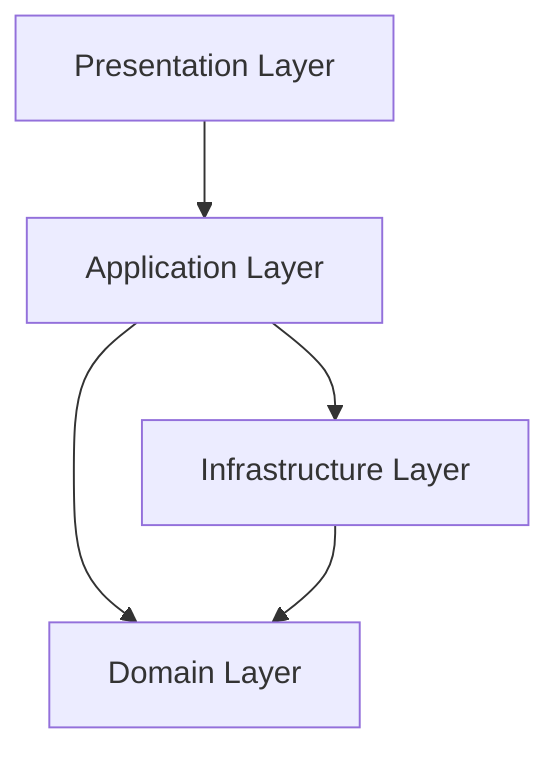

## Introduction

I implemented an API server using Rust and the axum framework.

### Target Audience

- Those who want to implement an API server with Rust
- Those who want to implement DDD with Rust

### What Won't Be Explained

- Basic Rust syntax
- Basic DDD concepts
- How to use the crates being used

## Direction of Dependencies



The dependency relationships in the architecture we're creating are shown above.
Keeping these dependency relationships in mind will deepen your understanding as you read through this article.
It's important that the domain layer doesn't depend on anything, and the infrastructure layer doesn't depend on the application layer.

## Let's Implement

### Deciding on Specifications

This time, I decided to create a system for universities to manage clubs.

- Members can be added
  - 4th-year students cannot be added
- Members can be removed
  - The owner cannot be removed
- 4th-year students graduate
- A club must have at least 3 members to operate
- A club has a maximum capacity
- A club needs a representative
- People 20 years or older can participate in drinking parties
- Only 3rd-year students can become club representatives

### Domain Layer

#### Circle Aggregate

First, let's create the domain layer.
The Circle aggregate consists of two entities: `Circle`, which serves as the aggregate root, and `Member`, which represents members within the aggregate.

```Rust
pub struct Circle {
    pub id: CircleId, // Circle ID (Value Object)
    pub name: String,
    pub capacity: usize,
    pub owner: Member,
    pub members: Vec<Member>,
}
```

```Rust
pub struct Member {
    pub id: MemberId, // Member ID (Value Object)
    pub name: String,
    pub age: usize,
    pub grade: Grade,
    pub major: Major,
}
```

The id uses `Value Object`. I won't explain the differences between `Entity` and `Value Object` this time, so if you're interested, please research them yourself.

:::details CircleId

```Rust
use std::fmt;
use std::hash::{Hash, Hasher};

#[derive(Debug, Clone, PartialEq, Eq)]
pub struct CircleId(usize);

impl CircleId {
    pub fn gen() -> Self {
        Self(rand::random::<usize>())
    }
}

impl std::convert::From<usize> for CircleId {
    fn from(id: usize) -> Self {
        Self(id)
    }
}

impl Hash for CircleId {
    fn hash<H: Hasher>(&self, state: &mut H) {
        self.0.hash(state);
    }
}

impl fmt::Display for CircleId {
    fn fmt(&self, f: &mut fmt::Formatter<'_>) -> fmt::Result {
        write!(f, "{}", self.0)
    }
}

impl std::convert::From<CircleId> for usize {
    fn from(circle_id: CircleId) -> usize {
        circle_id.0
    }
}
```

:::

Next, we'll implement methods to give knowledge to the aggregate.
In Rust, we use `impl` to implement methods on a `struct`.

```Rust
use crate::domain::aggregate::member::Member;
use crate::domain::aggregate::value_object::circle_id::CircleId;

use super::value_object::grade::Grade;
use anyhow::Error;

#[derive(Clone, Debug, Eq, PartialEq)]
pub struct Circle {
    pub id: CircleId, // Circle ID (Value Object)
    pub name: String,
    pub capacity: usize,
    pub owner: Member,
    pub members: Vec<Member>,
}

impl Circle {
    // Method to create a new circle
    pub fn new(name: String, owner: Member, capacity: usize) -> Result<Self, Error> {
        // Only 3rd-year students can be owners
        if owner.grade != Grade::Third {
            return Err(Error::msg("Owner must be 3rd grade"));
        }

        // Circle capacity must be 3 or more
        if capacity < 3 {
            return Err(Error::msg("Circle capacity must be 3 or more"));
        }

        Ok(Circle {
            id: CircleId::gen(),
            name,
            owner,
            capacity,
            members: vec![],
        })
    }

    // Method to reconstruct a circle
    pub fn reconstruct(
        id: CircleId,
        name: String,
        owner: Member,
        capacity: usize,
        members: Vec<Member>,
    ) -> Self {
        Circle {
            id,
            name,
            owner,
            capacity,
            members,
        }
    }

    // Method to update a circle
    pub fn update(&mut self, name: Option<String>, capacity: Option<usize>) {
        if let Some(name) = name {
            self.name = name;
        }
        if let Some(capacity) = capacity {
            self.capacity = capacity;
        };
    }

    // Method to determine if the circle is full
    fn is_full(&self) -> bool {
        self.members.len() + 1 >= self.capacity
    }

    // Method to determine if the circle can operate
    fn is_runnable(&self) -> bool {
        self.members.len() + 1 >= 3
    }

    // Method to determine if a member can participate in drinking parties
    fn is_drinkable_alcohol(member: &Member) -> bool {
        member.is_adult()
    }

    // Method to add a member to the circle
    pub fn add_member(&mut self, member: Member) -> Result<(), Error> {
        // Cannot join if the circle is full
        if self.is_full() {
            return Err(Error::msg("Circle member is full"));
        }

        // 4th-year students cannot join the circle
        if member.grade == Grade::Fourth {
            return Err(Error::msg("4th grade can't join circle"));
        }

        self.members.push(member);
        Ok(())
    }

    // Method to remove a member from the circle
    pub fn remove_member(&mut self, member: &Member) -> Result<(), Error> {
        // The owner cannot be removed
        if self.owner.id == member.id {
            return Err(Error::msg("Owner can't be removed"));
        }
        self.members.retain(|m| m.id != member.id);
        Ok(())
    }

    // Method to graduate 4th-year students
    pub fn graduate(&mut self) {
        self.members.retain(|m| m.grade != Grade::Fourth);
    }
}
```

```Rust
impl Member {
    // Method to create a new member
    pub fn new(name: String, age: usize, grade: Grade, major: Major) -> Self {
        Member {
            id: MemberId::gen(),
            name,
            age,
            grade,
            major,
        }
    }

    // Method to reconstruct a member
    pub fn reconstruct(id: MemberId, name: String, age: usize, grade: Grade, major: Major) -> Self {
        Member {
            id,
            name,
            age,
            grade,
            major,
        }
    }

    // Method to determine if a member is 20 years or older
    pub fn is_adult(&self) -> bool {
        self.age >= 20
    }
}
```

#### Interface

We'll create an interface to expose the domain's behavior to the outside.
We'll create an interface for manipulating the Circle aggregate.

```Rust
pub trait CircleRepositoryInterface {
    fn find_circle_by_id(&self, circle_id: &CircleId) -> Result<Circle, Error>;
    fn create(&self, circle: &Circle) -> Result<(), Error>;
    fn update(&self, circle: &Circle) -> Result<Circle, Error>;
    fn delete(&self, circle: &Circle) -> Result<(), Error>;
}
```

A `trait` is like an `interface` in other languages.

### Infrastructure Layer

The infrastructure layer handles persistence.
The persistence destination doesn't matter. It can be anything like `Firestore` or `Postgres`.
This time, I decided to save it in memory.

In the infrastructure layer, we implement the interface from the domain layer.

```Rust
use anyhow::Error;

use crate::domain::{
    aggregate::{
        circle::Circle,
        member::Member,
        value_object::{circle_id::CircleId, grade::Grade, major::Major, member_id::MemberId},
    },
    interface::circle_repository_interface::CircleRepositoryInterface,
};

use super::db::Db;

#[derive(Clone, Debug)]
pub struct CircleRepository {
    db: Db,
}

impl CircleRepository {
    pub fn new() -> Self {
        Self { db: Db::new() }
    }
}

impl CircleRepositoryInterface for CircleRepository {
    fn find_circle_by_id(&self, circle_id: &CircleId) -> Result<Circle, Error> {
        match self.db.get::<CircleData, _>(&circle_id.to_string())? {
            Some(data) => Ok(Circle::try_from(data)?),
            None => Err(Error::msg("Circle not found")),
        }
    }

    fn create(&self, circle: &Circle) -> Result<(), Error> {
        match self.db.get::<CircleData, _>(&circle.id.to_string())? {
            Some(_) => Err(Error::msg("Circle already exists")),
            None => {
                self.db
                    .set(circle.id.to_string(), &CircleData::from(circle.clone()))?;
                Ok(())
            }
        }
    }

    fn update(&self, circle: &Circle) -> Result<Circle, Error> {
        match self.db.get::<CircleData, _>(&circle.id.to_string())? {
            Some(_) => self
                .db
                .set(circle.id.to_string(), &CircleData::from(circle.clone()))
                .and_then(|_| self.db.get::<CircleData, _>(&circle.id.to_string()))
                .map(|data| match data {
                    Some(data) => Circle::try_from(data),
                    None => Err(Error::msg("Failed to convert circle data")),
                })?,
            None => Err(Error::msg("Circle not found")),
        }
    }

    fn delete(&self, circle: &Circle) -> Result<(), Error> {
        match self.db.get::<CircleData, _>(&circle.id.to_string())? {
            Some(_) => self.db.remove(circle.id.to_string()),
            None => Err(Error::msg("Circle not found")),
        }
    }
}

#[derive(serde::Deserialize, serde::Serialize)]
struct CircleData {
    id: usize,
    name: String,
    owner: MemberData,
    capacity: usize,
    members: Vec<MemberData>,
}

impl std::convert::From<Circle> for CircleData {
    fn from(circle: Circle) -> Self {
        CircleData {
            id: circle.id.into(),
            name: circle.name,
            owner: MemberData::from(circle.owner),
            capacity: circle.capacity,
            members: circle.members.into_iter().map(MemberData::from).collect(),
        }
    }
}

impl std::convert::TryFrom<CircleData> for Circle {
    type Error = Error;

    fn try_from(data: CircleData) -> Result<Self, Self::Error> {
        Ok(Circle::reconstruct(
            CircleId::from(data.id),
            data.name,
            Member::reconstruct(
                MemberId::from(data.owner.id),
                data.owner.name,
                data.owner.age,
                Grade::try_from(data.owner.grade)?,
                Major::from(data.owner.major.as_str()),
            ),
            data.capacity,
            data.members
                .into_iter()
                .map(Member::try_from)
                .collect::<Result<Vec<Member>, Error>>()?,
        ))
    }
}

#[derive(serde::Deserialize, serde::Serialize)]
struct MemberData {
    id: usize,
    name: String,
    age: usize,
    grade: usize,
    major: String,
}

impl std::convert::From<Member> for MemberData {
    fn from(value: Member) -> Self {
        Self {
            id: value.id.into(),
            name: value.name,
            age: value.age,
            grade: value.grade.into(),
            major: value.major.into(),
        }
    }
}

impl std::convert::TryFrom<MemberData> for Member {
    type Error = Error;

    fn try_from(value: MemberData) -> Result<Self, Self::Error> {
        Ok(Member::reconstruct(
            MemberId::from(value.id),
            value.name,
            value.age,
            Grade::try_from(value.grade)?,
            Major::from(value.major.as_str()),
        ))
    }
}
```

The values retrieved from the database are represented with names like `XxxData`. In this case, `CircleData` and `MemberData`.
To convert these database types to domain layer types, we implement the `TryFrom` trait and internally use the `reconstruct` method to convert to the domain layer's `Entity` types.
Since the DB is in-memory this time, it may not feel very meaningful, but it's effective for eliminating dependencies with the application layer.
Even if the DB suddenly changes to `Firebase`, you only need to change the database types without affecting the application layer.
To achieve this, it's important to make the application layer depend on abstractions rather than depending on the infrastructure layer (more on this later).

Since the DB implementation isn't directly related to DDD, please check it out if you're interested.
:::details In-memory DB implementation

```Rust
use std::{
    collections::HashMap,
    sync::{Arc, RwLock},
};

#[derive(Clone, Debug)]
pub struct Db {
    db: Arc<RwLock<HashMap<String, String>>>,
}

impl Db {
    pub fn new() -> Self {
        Self {
            db: Arc::new(RwLock::new(HashMap::new())),
        }
    }

    pub fn get<D, K>(&self, key: K) -> anyhow::Result<Option<D>>
    where
        K: AsRef<str>,
        D: serde::de::DeserializeOwned,
    {
        let db = self
            .db
            .read()
            .map_err(|e| anyhow::anyhow!("Error reading from database: {:?}", e))?;

        match db.get(key.as_ref()) {
            Some(value) => {
                let deserialized_value = serde_json::from_str(value)
                    .map_err(|e| anyhow::anyhow!("Error deserializing value: {:?}", e))?;
                Ok(Some(deserialized_value))
            }
            None => Ok(None),
        }
    }

    pub fn keys(&self) -> Vec<String> {
        let db = self.db.read().expect("read data from db");
        db.keys().cloned().collect()
    }

    pub fn remove<K>(&self, key: K) -> anyhow::Result<()>
    where
        K: AsRef<str>,
    {
        let mut db = self
            .db
            .write()
            .map_err(|e| anyhow::anyhow!("Error writing to database: {:?}", e))?;
        db.remove(key.as_ref())
            .ok_or_else(|| anyhow::anyhow!("Key not found in database"))?;
        Ok(())
    }

    pub fn set<S, K>(&self, key: K, value: &S) -> anyhow::Result<()>
    where
        K: Into<String>,
        S: serde::ser::Serialize,
    {
        let value = serde_json::to_string(value)?;
        let mut db = self
            .db
            .write()
            .map_err(|e| anyhow::anyhow!("Error writing to database: {:?}", e))?;
        db.insert(key.into(), value);
        Ok(())
    }
}
```

RwLock is used for exclusive control.
:::

### Application Layer

In the application layer, we use `Entity` and `VO` to request processing from the repository (infrastructure layer) to realize use cases.
We request processing from the repository but don't depend on the infrastructure layer.
We realize use cases using the so-called Dependency Inversion Principle.
We use traits to depend on abstractions rather than implementations.
This time, we'll implement a use case for creating a circle.

```Rust
use anyhow::Result;
use serde::Deserialize;

use crate::domain::{
    aggregate::{
        circle::Circle,
        member::Member,
        value_object::{grade::Grade, major::Major},
    },
    interface::circle_repository_interface::CircleRepositoryInterface,
};

#[derive(Debug, Deserialize)]
pub struct CreateCircleInput {
    pub circle_name: String,
    pub capacity: usize,
    pub owner_name: String,
    pub owner_age: usize,
    pub owner_grade: usize,
    pub owner_major: String,
}

impl CreateCircleInput {
    pub fn new(
        circle_name: String,
        capacity: usize,
        owner_name: String,
        owner_age: usize,
        owner_grade: usize,
        owner_major: String,
    ) -> Self {
        CreateCircleInput {
            circle_name,
            capacity,
            owner_name,
            owner_age,
            owner_grade,
            owner_major,
        }
    }
}

#[derive(Debug, Deserialize)]
pub struct CreateCircleOutput {
    pub circle_id: usize,
    pub owner_id: usize,
}

pub struct CreateCircleUsecase<T>
where
    T: CircleRepositoryInterface,
{
    circle_repository: T,
}

impl<T> CreateCircleUsecase<T>
where
    T: CircleRepositoryInterface,
{
    pub fn new(circle_repository: T) -> Self {
        CreateCircleUsecase { circle_repository }
    }

    pub fn execute(
        &mut self,
        circle_circle_input: CreateCircleInput,
    ) -> Result<CreateCircleOutput> {
        let grade = Grade::try_from(circle_circle_input.owner_grade)?;

        let major = Major::from(circle_circle_input.owner_major.as_str());

        let owner = Member::new(
            circle_circle_input.owner_name,
            circle_circle_input.owner_age,
            grade,
            major,
        );
        let owner_id = owner.id;
        let circle = Circle::new(
            circle_circle_input.circle_name,
            owner,
            circle_circle_input.capacity,
        )?;
        self.circle_repository
            .create(&circle)
            .map(|_| CreateCircleOutput {
                circle_id: usize::from(circle.id),
                owner_id: usize::from(owner_id),
            })
    }
}
```

Let's look at each part one by one.

1. Use case I/O (Input/Output)
   We define the use case's I/O as `CreateCircleInput` and `CreateCircleOutput`.
2. CreateCircleUsecase struct
   `CreateCircleUsecase` is a generic struct. Its field receives something that implements the `CircleRepositoryInterface` trait.

3. impl CreateCircleUsecase
   We implement two methods for the `CreateCircleUsecase` struct: `new` and `execute`.

   - new method
     A method to create an instance. It receives something that implements the `CircleRepositoryInterface` trait.
     This is like a constructor in other languages. Here, we inject the dependency. By setting an abstraction (trait) rather than an implementation, we realize the Dependency Inversion Principle.

   - execute method
     A method to execute the use case. It receives `CreateCircleInput`, creates a `Circle Entity`, and saves it to the repository.
     `self` refers to the `CreateCircleUsecase` itself. Since there's only one field this time, we can access the field with `self.circle_repository`, and since it's guaranteed that the field implements the `CircleRepositoryInterface` trait, we can call the `create` method.

This way, we've implemented the use case to depend only on the domain and not on the infrastructure layer.

### Presentation Layer

In the presentation layer, we define endpoints, receive requests, send responses, and map values to pass to the application layer.

```Rust
#[derive(Debug, serde::Deserialize, serde::Serialize)]
pub struct CreateCircleRequestBody {
    pub circle_name: String,
    pub capacity: usize,
    pub owner_name: String,
    pub owner_age: usize,
    pub owner_grade: usize,
    pub owner_major: String,
}

impl std::convert::From<CreateCircleRequestBody> for CreateCircleInput {
    fn from(
        CreateCircleRequestBody {
            circle_name,
            capacity,
            owner_name,
            owner_age,
            owner_grade,
            owner_major,
        }: CreateCircleRequestBody,
    ) -> Self {
        CreateCircleInput::new(
            circle_name,
            capacity,
            owner_name,
            owner_age,
            owner_grade,
            owner_major,
        )
    }
}

#[derive(Debug, serde::Deserialize, serde::Serialize)]
pub struct CreateCircleResponseBody {
    pub circle_id: usize,
    pub owner_id: usize,
}

impl std::convert::From<CreateCircleOutput> for CreateCircleResponseBody {
    fn from(
        CreateCircleOutput {
            circle_id,
            owner_id,
        }: CreateCircleOutput,
    ) -> Self {
        CreateCircleResponseBody {
            circle_id,
            owner_id,
        }
    }
}

pub async fn handle_create_circle(
    State(state): State<AppState>,
    Json(body): Json<CreateCircleRequestBody>,
) -> Result<Json<CreateCircleResponseBody>, String> {
    let circle_circle_input = CreateCircleInput::from(body);
    let mut usecase = CreateCircleUsecase::new(state.circle_repository);
    usecase
        .execute(circle_circle_input)
        .map(CreateCircleResponseBody::from)
        .map(Json)
        .map_err(|e| e.to_string())
}

#[derive(Clone)]
struct AppState {
    circle_repository: CircleRepository,
}

fn router() -> Router<AppState> {
    Router::new()
        .route("/circle", post(handle_create_circle))
}

#[tokio::main]
async fn main() -> Result<(), ()> {
    let state = AppState {
        circle_repository: CircleRepository::new(),
    };

    let app = router().with_state(state);

    let listener = tokio::net::TcpListener::bind("127.0.0.1:3000")
        .await
        .unwrap();
    println!("Listening on: {}", listener.local_addr().unwrap());
    axum::serve(listener, app).await.unwrap();
    Ok(())
}
```

Let's look at each part one by one.

1. I/O (Input/Output)
   `CreateCircleRequestBody` is a struct for receiving the request body.
   We implement `from` for `CreateCircleRequestBody` so that we can construct `CreateCircleInput`.

   The response is implemented in a similar way.

2. AppState
   `AppState` is a struct that represents the application's state. It's provided by `axum`. In this application, it holds the repository and plays a role like a DI container that resolves dependencies.
   Since there's only one dependency this time, it may not feel very beneficial, but for example, during testing, you can replace `CircleRepository` with a mock like `CircleRepositoryMock`.
3. handle_create_circle
   The `handle_create_circle` function receives a request and executes `CreateCircleUsecase`.
   The first argument `State(state)` extracts the value of `AppState`.
   We inject the extracted value into `CreateCircleUsecase` and call the `execute` method. This is the part that executes the `usecase` mentioned earlier. The I/O is converted to the respective formats.

## Conclusion

I implemented an API server using Rust, axum, and DDD. Although Rust adoption in business is still low, I think it will gain momentum starting with backend development, so please give it a try. I also hope that adding new use cases and aggregates will help with your learning.
The source code for this is available [here](https://github.com/katayama8000/axum-ddd-rust). Since the main branch is being updated, please refer to [ver 0.1.0](https://github.com/katayama8000/axum-ddd-rust/releases/tag/0.1.0) for the source code at the time of writing this article.
